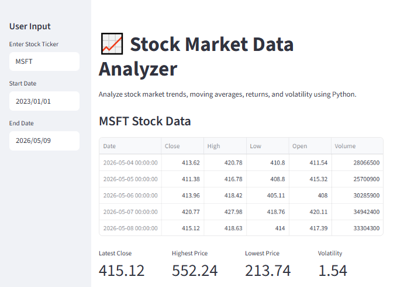
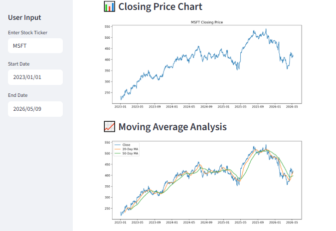
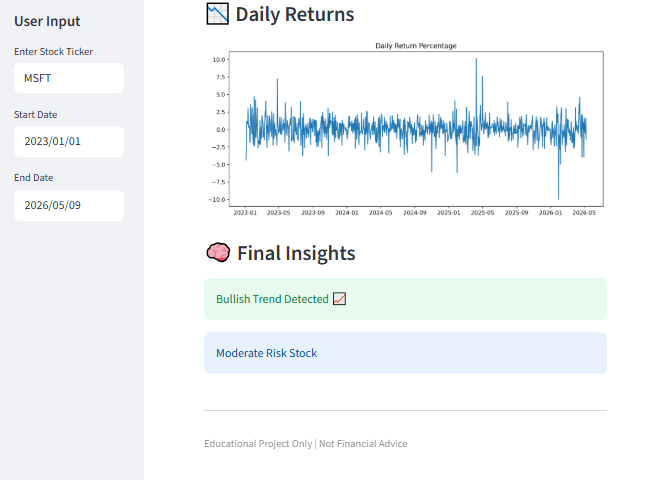

# 📈 Stock Market Data Analyzer

A Python-based financial analytics system that fetches real-time stock market data, performs technical analysis, generates visual insights, provides an interactive Streamlit dashboard, and exposes FastAPI endpoints.

---

## 🚀 Features

- ✅ Stock market data collection using Yahoo Finance
- ✅ Daily returns analysis
- ✅ Moving average analysis
- ✅ Volatility and risk analysis
- ✅ Financial report generation
- ✅ Interactive Streamlit dashboard
- ✅ FastAPI backend API
- ✅ Automated chart generation

---

## 🛠️ Tech Stack

| Tool | Purpose |
|------|---------|
| Python | Core programming language |
| Pandas | Data manipulation & analysis |
| NumPy | Numerical computations |
| Matplotlib | Chart generation |
| Seaborn | Statistical visualizations |
| yfinance | Yahoo Finance data fetching |
| Streamlit | Interactive dashboard |
| FastAPI | REST API backend |
| Uvicorn | ASGI server |

---

## 📂 Project Structure

```
Stock-Market-Data-Analyzer/
│
├── data/                  # Raw and processed stock data
├── images/                # Static image assets
├── outputs/               # Generated output files
├── reports/               # Financial summary reports
├── screenshots/           # Dashboard screenshots
├── src/                   # Source modules
│
├── api.py                 # FastAPI backend
├── dashboard.py           # Streamlit dashboard
├── main.py                # Main analysis script
├── requirements.txt       # Python dependencies
└── README.md              # Project documentation
```

---

## ⚙️ Installation

### 1. Clone the Repository

```bash
git clone https://github.com/YOUR-USERNAME/Stock-Market-Data-Analyzer.git
```

### 2. Navigate into the Project Folder

```bash
cd Stock-Market-Data-Analyzer
```

### 3. Create a Virtual Environment

**Windows:**
```bash
python -m venv venv
venv\Scripts\activate
```

**macOS/Linux:**
```bash
python3 -m venv venv
source venv/bin/activate
```

### 4. Install Dependencies

```bash
pip install -r requirements.txt
```

---

## ▶️ Run the Project

### Run Main Analysis

```bash
python main.py
```

### Run the Dashboard

```bash
streamlit run dashboard.py
```

### Run the API Server

```bash
uvicorn api:app --reload
```

---

## 📊 Outputs

### Dashboard UI

## 📊 Outputs

> Screenshots from the interactive Streamlit dashboard:

| UI 1 | UI 2 | UI 3 |
|------|------|------|
|  |  |  |

## 📈 Generated Features

- Stock closing price charts
- Moving average analysis
- Daily returns visualization
- Volatility analysis
- Financial summary reports
- API-based stock analytics

---

## 🧠 Learning Outcomes

Through this project, I learned:

- Financial data analysis
- Data visualization
- API development
- Dashboard development
- Python automation
- GitHub project management

---


## 👨‍💻 Author

**Tanuja Solunke**

---

> ⭐ If you found this project helpful, consider giving it a star!